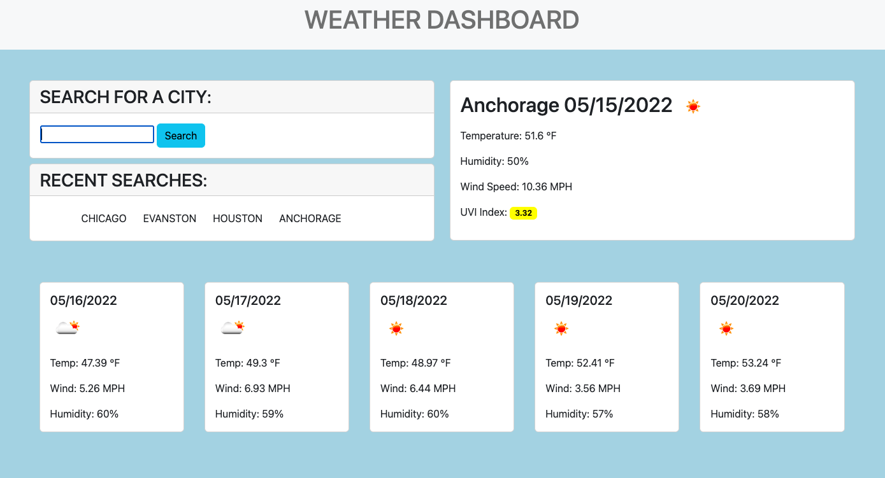

# Weather Dashboard

## Description

This is a weather dashboard, created using Javascript, Bootstrap, jQuery, Moment.JS, and the Open Weather Map API [link to the deployed page](https://ajolsavsky.github.io/weather-dashboard/).

Some things that I learned while creating this project:

- I learned how to use Open Weather Map API to successfully render data
- Honed skills using Moment/Unix time to render future data
- This was my first time working with Bootstrap in a more robust way, so I learned some of those properties well
- I learned how to call separate API links to collect separate data

## User Story

```
AS A traveler
I WANT to see the weather outlook for multiple cities
SO THAT I can plan a trip accordingly
```


## Acceptance Criteria

```
GIVEN a weather dashboard with form inputs
WHEN I search for a city
THEN I am presented with current and future conditions for that city and that city is added to the search history
WHEN I view current weather conditions for that city
THEN I am presented with the city name, the date, an icon representation of weather conditions, the temperature, the humidity, the wind speed, and the UV index
WHEN I view the UV index
THEN I am presented with a color that indicates whether the conditions are favorable, moderate, or severe
WHEN I view future weather conditions for that city
THEN I am presented with a 5-day forecast that displays the date, an icon representation of weather conditions, the temperature, the wind speed, and the humidity
WHEN I click on a city in the search history
THEN I am again presented with current and future conditions for that city
```

## Usage

Here is an example of the final page.



## Credits

This project and related assets are associated with the Triolgy Coding Bootcamp.

## License

© 2022 Trilogy Education Services, LLC, a 2U, Inc. brand. Confidential and Proprietary. All Rights Reserved.
